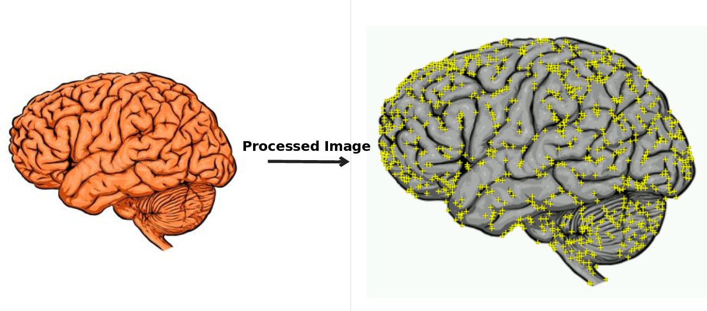
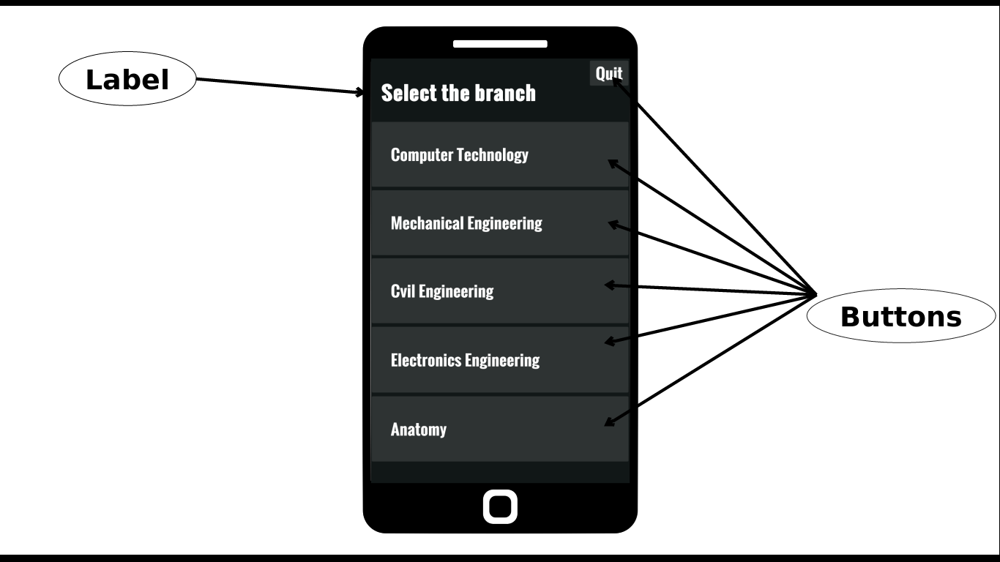
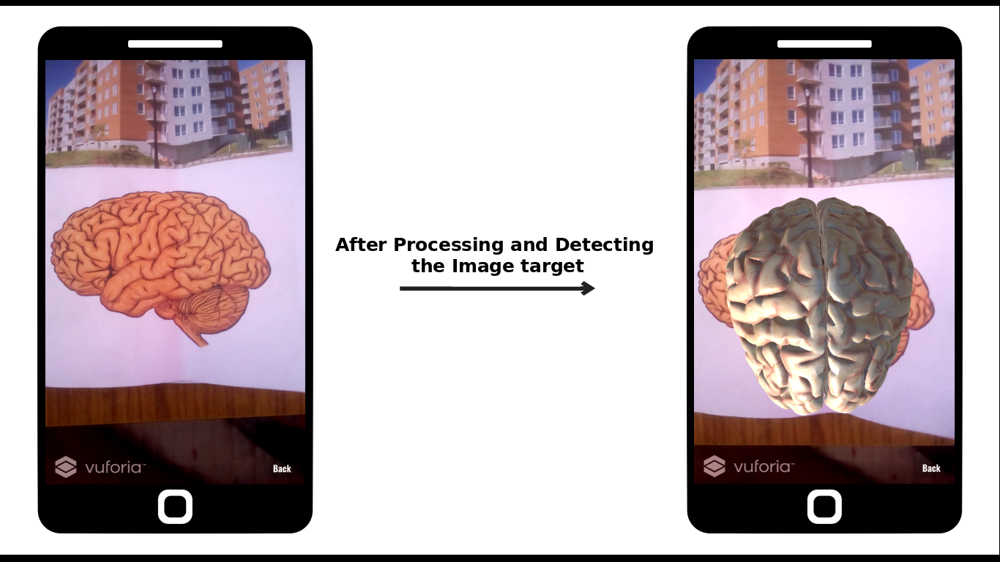
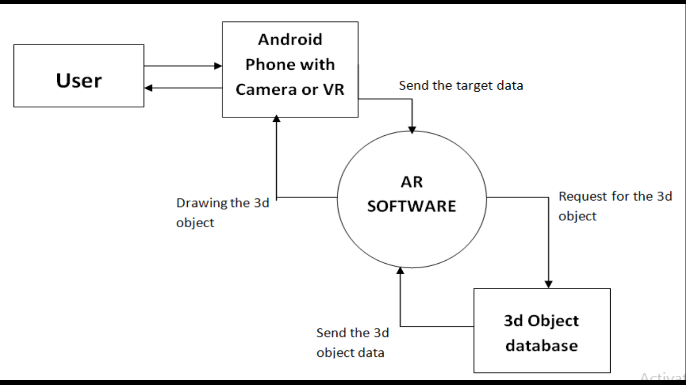

# AR App for Education
Our Augmented Reality based app which can be used by students with their traditional textbooks. This app will help students to visualize the three dimensional representation of the entity they are learning about. This app allows to understand the concepts easily and way better than just seeing the 2d pictorial format of the subject. Basic requirement of the app will be a Android phone or tablet on which our app will run
 

Our App is made with Unity3d Game Engine, which uses C# language. We have also used following Vuforia SDK for Image Processing and Detection.

<b>[Vufoira SDK](https://developer.vuforia.com/)</b> - 
Vuforia is an augmented reality software development kit (SDK) for mobile devices that enables the creation of augmented reality applications.

 

**Layout and Design of our App** -
 

This is how our Home Screen looks which have Various buttons which takes you to the particular camera module for detects and Augments a 3d model.

This is how our app Augments the 3d model after detecting the image.

 

There is a [Images](./READMEstuff/Images) folder which can be used with our App which is present in RELEASES.

Full video of Demonstration of our app is available at [My Twitter Feed](https://twitter.com/gouravkolhatkar/status/1309843990406021121?s=19).

 

**ER Diagram of Our App** -

